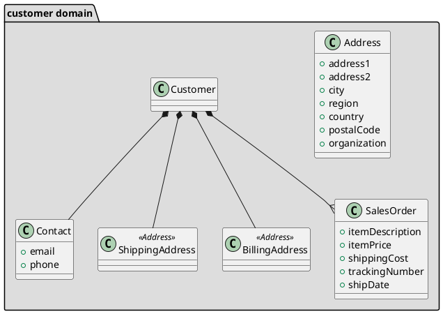
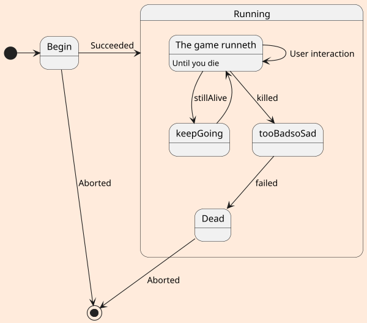

# CheatSheet_Markdown
CheatSheet Markdown

### uml: class diagram

```plantuml
@startuml
package "customer domain" #DDDDDD {
    class Contact {
        + email
        + phone
    }

    class Address {
        + address1
        + address2
        + city
        + region
        + country
        + postalCode
        + organization
    }

    class Customer {
    }

    Customer *-- Contact
    Customer *-- ShippingAddress
    Customer *-- BillingAddress
    Customer *--{ SalesOrder

    class ShippingAddress <<Address>>
    class BillingAddress <<Address>>
    class SalesOrder {
        + itemDescription
        + itemPrice
        + shippingCost
        + trackingNumber
        + shipDate
    }
}
@enduml
```

## uml: state diagram

```plantuml
@startuml
scale 600 width
skinparam backgroundColor #FFEBDC
[*] -> Begin
Begin -right-> Running : Succeeded
Begin --> [*] : Aborted
state Running {
  state "The game runneth" as long1
  long1 : Until you die
  long1 --> long1 : User interaction
  long1 --> keepGoing : stillAlive
  keepGoing --> long1
  long1 --> tooBadsoSad : killed
  tooBadsoSad --> Dead : failed
}
Dead --> [*] : Aborted
@enduml
```