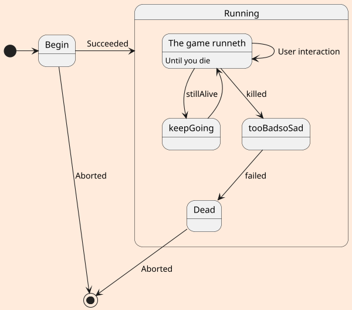

## uml: state diagram
1
```plantuml
SELECT  *
FROM  TMP
```
2

Regular **Markdown** here.

<div hidden>
```
@startuml firstDiagram

Alice -> Bob: Hello
Bob -> Alice: Hi!
		
@enduml
```
</div>


Some more markdown.



